# QLACK-Base-Application

The QLACK Base Application is a full-stack blueprint, featuring Angular and Spring Boot. You can
start your new project by cloning this repo and then built on top of it.

[](https://gitpod.io/#https://github.com/qlack/QLACK-Base-Application)


## Features

### Login / Logout with JWT integration

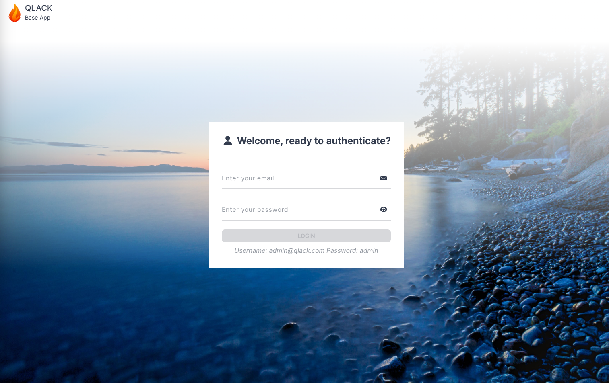

### Theme support

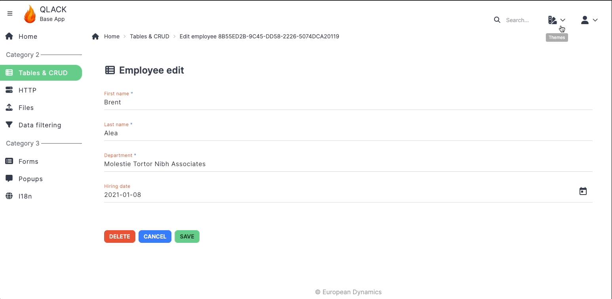

### Dynamic collapsible sibebar, dynamic breadcrumb
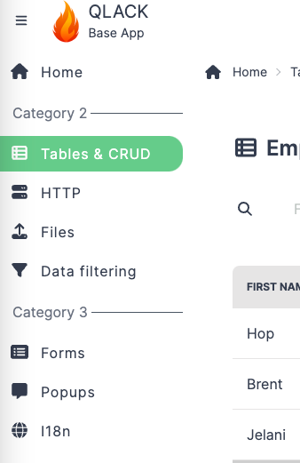
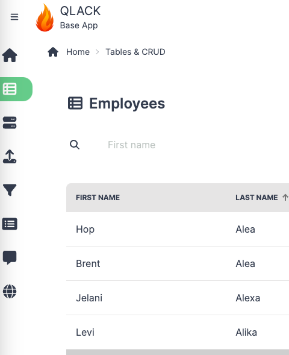


### Tables with sorting, pagination, and filtering with minimal code

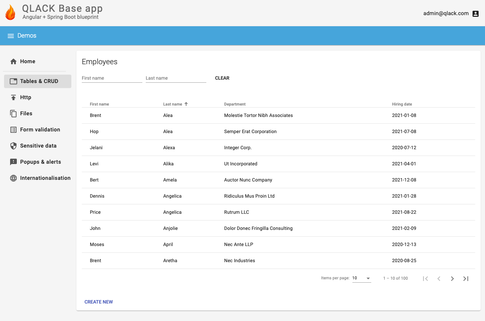

### CRUD examples

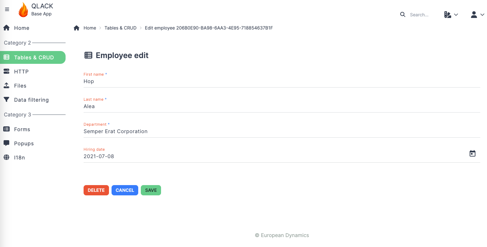

### HTTP progress bars

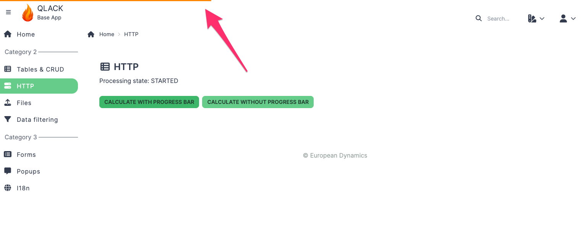

### File upload / download

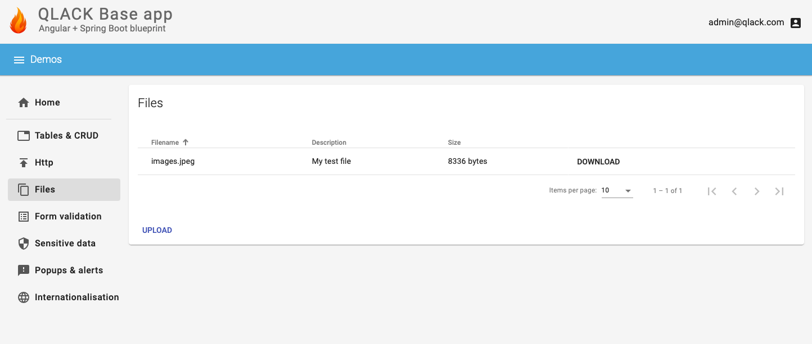

### Form back-end validation

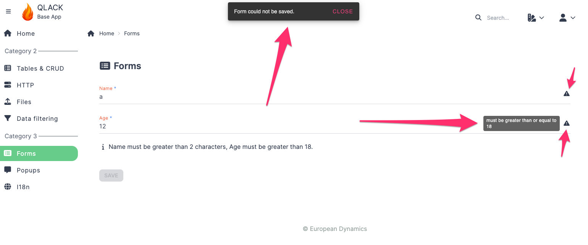

### Annotation-based content filtering
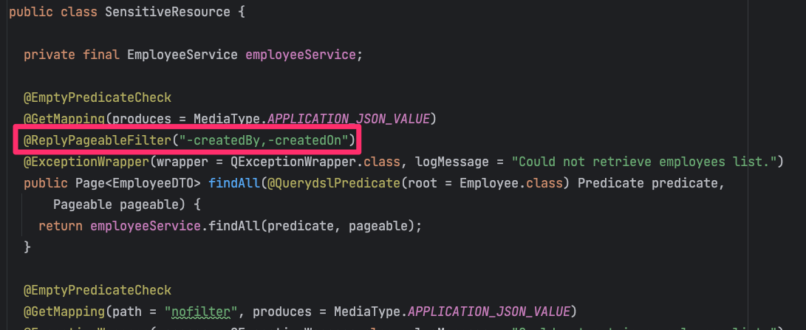

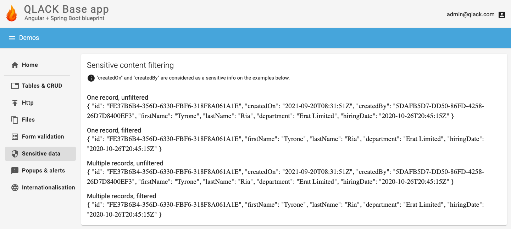

### Standardised popups

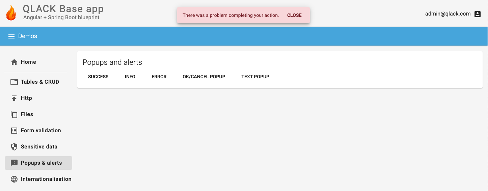

### Internationalisation

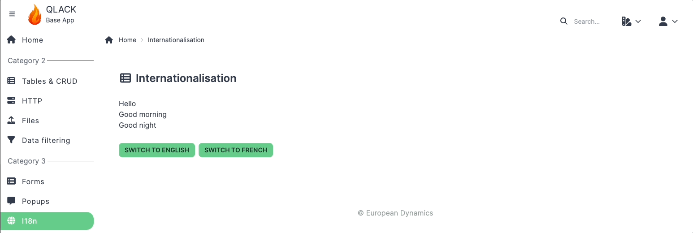

## Development setup

To start the back-end component, issue:

`mvn spring-boot:run`

To start the front-end component, issue:

`ng start`

## Containers support

Both the front-end and the back-end component come with a `Dockerfile` allowing you to build Docker
images.

The supplied build scripts provide two interesting features:

* The application is built within a Docker container, so no local Java or Angular/NodeJS environment
  is necessary. This allows anyone to clone your project and build Docker containers for it without
  any additional setup.

* Image building follows a multi-stage approach. Expensive operations (such as downloading Maven
  artifacts or NodeJS packages) takes place in a previous phase of your build, allowing you to skip
  those phases in future builds (provided your dependencies remain the same).
  
A top-level Docker Compose file is also provided, allowing you to build and run the complete application
stack in just a single command:

`docker compose up --build`

The application becomes accessible on port 6565, i.e. http://localhost:6565. 

## Extra Security Feature CustomCookieFilter

The `CustomCookieFilter` is a filter designed to create a token and place it in a cookie, subsequently validating this token with every request. Specifically, it involves JWT authentication. During the initial login process, a token is generated and placed in a cookie. Each cookie has a timer associated with it, expiring either when the JWT expires or becomes invalid after its first use for a single request. Upon each request, the previously generated token is validated, and a new one is created, replacing the old token in a cookie. An exception to this process occurs during logout, where this filter is skipped.

In the case of multiple requests, old cookies are kept alive for a short time, with a default of 60 seconds. This is implemented to prevent conflicts when the server experiences a delay and is unable to send back a new cookie for the next request. This duration is configurable through the `cookie-timer` property in the application file.

Furthermore, cookies are stored in a cache, and a scheduler is in place to clean this cache. The cleaning schedule can be modified using the `cookie-cache-clean-timer` property, which uses a cron-like expression (`0 * * ? * *` in the provided example).

To implement this functionality, the following line of code should be added to your `WebSecurity` class within the `SecurityFilterChain`:

```java
.addFilterBefore(customCookieFilter, BasicAuthenticationFilter.class)
```

Additionally, the following properties should be added to your application file:

```yaml
customCookieFilter:
  cookie-name: COOKIE-TOKEN # the name of the cookie
  cookie-timer: 60 # per seconds, the timer for keeping old cookies alive for multiple requests
  cookie-cache-clean-timer: 0 * * ? * * # the scheduler where we clean cache from non-valid cookies
  login-path: '/**/users/auth' 
  logout-path: '/**/users/logout'
```

Ensure these configurations are in place for the filter to function correctly.
